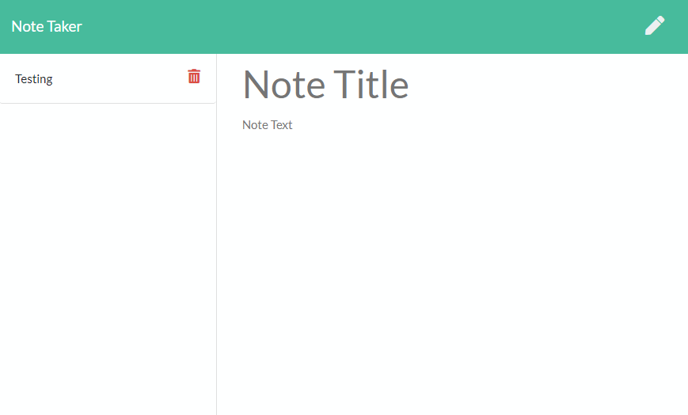

# Note Taker

## Description
This allows you to view, create, and save notes

## Table of Contents
* [Installation Instructions](<#installation-instructions>)
* [Usage Information](<#usage-information>)
* [Collaborators](<#collaborators>)
* [Contribution Guidelines](<#contribution-guidelines>)
* [Test Instructions](<#test-instructions>)
* [License](<#license>)
* [Questions](<#questions>)

## Screenshot

## Installation Instructions
No installation necessary, just navigate to https://gentle-beyond-27554.herokuapp.com/

## Usage Information
Click Get Started, Put in the note title, add your note

## Collaborators
[https://github.com/HeavensRegent](https://github.com/HeavensRegent)

## Contribution Guidelines
Forking and pull requests

## Test Instructions
None

## License
MIT License

## Questions
View my Github Profile at [https://github.com/HeavensRegent](https://github.com/HeavensRegent)

Contact me at blstarwars1@gmail.com
